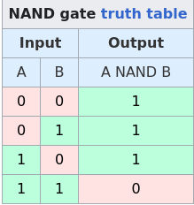

# NAND Gate and 1-Bit System

## NAND Gate
A **NAND gate** is a digital logic gate that performs the **NOT-AND** operation. It outputs `0` (low) only when **all** its inputs are `1` (high); otherwise, it outputs `1` (high). It is a **universal gate**, meaning any other logic gate (AND, OR, NOT, etc.) can be constructed using only NAND gates. It has two or more inputs and one output.

## 1-Bit System
A **1-bit system** is the simplest digital system, capable of representing two states: `0` (off) or `1` (on). It processes one binary digit at a time and is the foundation of all digital computing.

