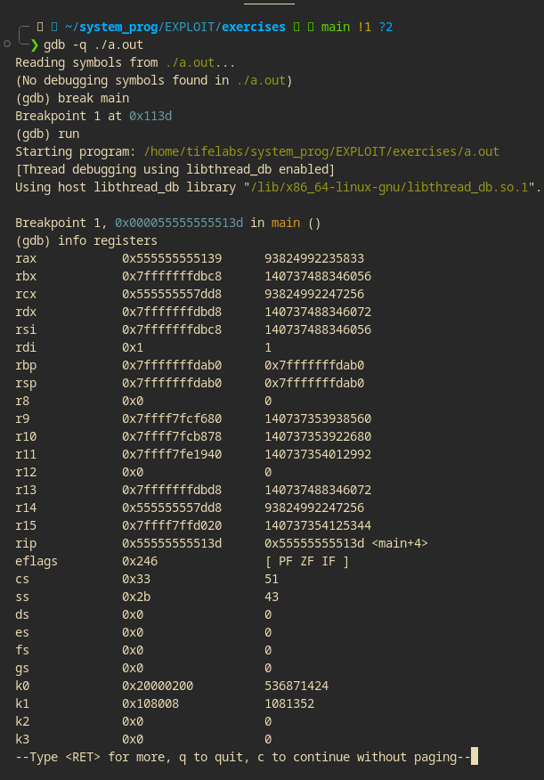

#### The x86 Processor
The 8086 CPU was the first x86 processor.It contains several internal variables for the processor
___
>GDB is a GNU dev debugger.
___
>GDB is used to show the state of the processor registers right before the program starts. 
___
#### Testing the use of gdb.

___

The Breakpoint is set on the main() function so execution will stop before the code is executed.