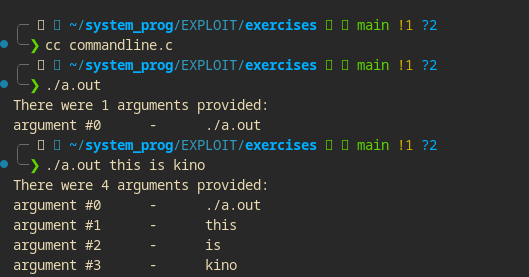

#   Command-Line Arguments

Command Line arguments don't require user interaction after the program has begun execution.

It can be accessed in the **main()** function by including two additional arguments to the function : **an integer and a pointer** to an array of strings.

The integer will contain the number of arguments, and the array of strings will contain each of those arguments.

