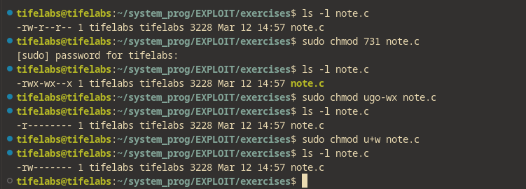
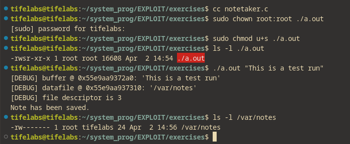

#### File Permissions

- S_IRUSR : Give the file read permission for the user (owner).
- S_IWUSR:  Give the file write permission for the user (owner).
- S_IXUSR:  Give the file execute permission for the user(owner).
- S_IRGRP:  Give the file read permission for the group.
- S_IWGRP:  Give the file write permission for the group.
- S_IXGRP:  Give the file execute permission for the group.
- S_IROTH:  Give the file read permission for the other (anyone).
- S_IWOTH:  Give the file write permission for the other (anyone).
- S_IXOTH:  Give the file execute permission for the other (anyone).

***

> Each permission corresponds to a bit flag

- 4 -> (100 in binary) (READ)
- 2 -> (010 in binary) (WRITE)
- 1 -> (001 in binary) (EXECUTE)

***

\

\
The argument ugo-wx means **subtract write and execute permission from user,group and other** 
\
The chmod u+w command **gives write permission to user**
\
\
Working with more examples:
\

