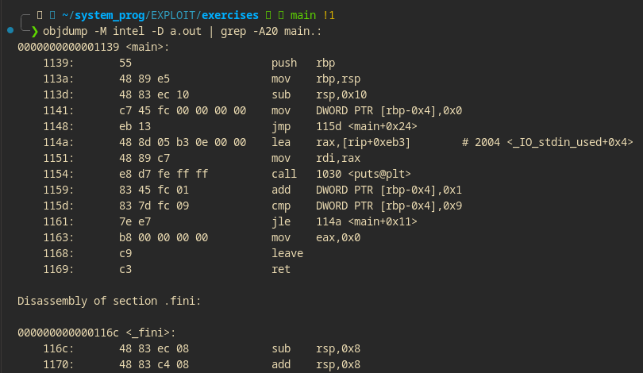

### OBJDUMP
___

#### objdump in C

objdump is a powerful command-line tool for analyzing object files, executables, and libraries. Whether you're debugging, reverse engineering, or exploring binary structures, objdump provides invaluable insights.

objdump -D a.out:

    Disassembles the entire binary file a.out.
    The -D flag dumps all the sections, including both code and data, as disassembled machine code and assembly instructions.

| (Pipe):

    Passes the output of the objdump -D command as input to the next command (grep).

grep -A20 main.::

    grep: Searches for lines containing main.:.
    -A20: Displays the matching line and 20 lines after it.

___

Summary of Command:

objdump -M intel -D a.out | grep -A20 main.:

    objdump -M intel -D a.out: Disassembles the entire binary a.out using Intel syntax for easier readability.
    grep -A20 main.:: Filters the output to locate the main function and displays the next 20 lines of assembly instructions after it.

Purpose:

This command helps to:

    Find and analyze the assembly code of the main function in the binary.
    View how the compiler translated main into machine instructions for debugging or learning.

##### Common Commands
 Disassemble Code

Disassemble the executable or object file into assembly instructions along with machine code.
~~~
objdump -d <file>
~~~

##### View Symbols

Display the symbol table, including functions, variables, and other symbols.

~~~
objdump -t <file>
~~~

##### Section Headers

List section headers like .text, .data, and .bss to analyze memory layout.

~~~
objdump -h <file>
~~~

##### Relocation Info

View relocation entries, showing adjustments needed for symbol addresses.
~~~
objdump -r <file>
~~~

##### Debug Info

Show debug symbols, assuming the binary was compiled with debugging information (-g).
~~~
objdump -g <file>
~~~

##### File Headers

Display file headers, including architecture type, entry point, and more.
~~~
objdump -f <file>
~~~

Dynamic Sections

View shared library dependencies and related metadata.
~~~
objdump -p <file>
~~~
##### All Info

Dump all available information about the file for comprehensive analysis.
~~~
objdump -x <file>
~~~

##### Use Cases

    Debugging compiled C code.
    Reverse engineering binaries.
    Analyzing binary structures, dependencies, and memory layouts.

>**_NOTE_ :** Processors also have their own set of  special variable called registers.