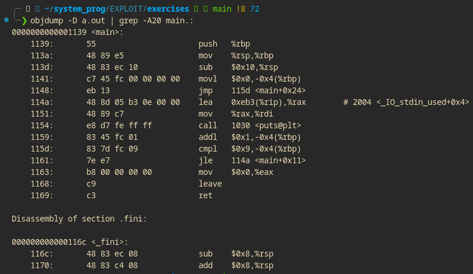

### OBJDUMP
___

#### objdump in C

objdump is a powerful command-line tool for analyzing object files, executables, and libraries. Whether you're debugging, reverse engineering, or exploring binary structures, objdump provides invaluable insights.

##### Common Commands
 Disassemble Code

Disassemble the executable or object file into assembly instructions along with machine code.
~~~
objdump -d <file>
~~~

##### View Symbols

Display the symbol table, including functions, variables, and other symbols.

~~~
objdump -t <file>
~~~

##### Section Headers

List section headers like .text, .data, and .bss to analyze memory layout.

~~~
objdump -h <file>
~~~

##### Relocation Info

View relocation entries, showing adjustments needed for symbol addresses.
~~~
objdump -r <file>
~~~

##### Debug Info

Show debug symbols, assuming the binary was compiled with debugging information (-g).
~~~
objdump -g <file>
~~~

##### File Headers

Display file headers, including architecture type, entry point, and more.
~~~
objdump -f <file>
~~~

Dynamic Sections

View shared library dependencies and related metadata.
~~~
objdump -p <file>
~~~
##### All Info

Dump all available information about the file for comprehensive analysis.
~~~
objdump -x <file>
~~~

##### Use Cases

    Debugging compiled C code.
    Reverse engineering binaries.
    Analyzing binary structures, dependencies, and memory layouts.