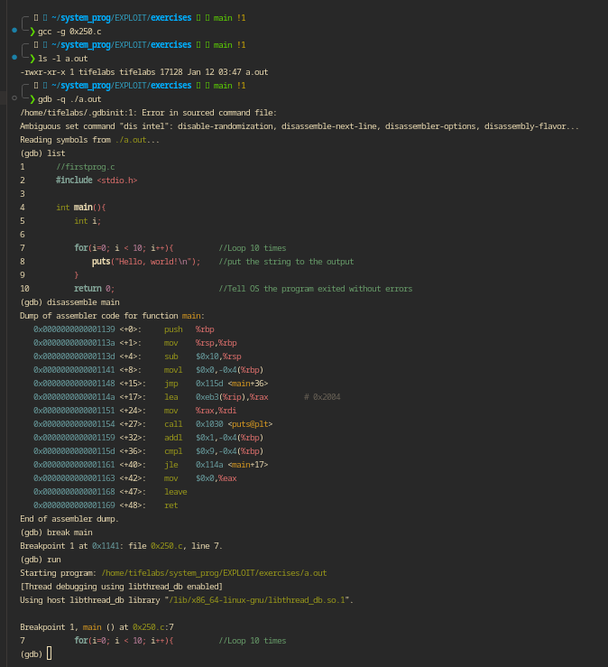

#### ASSEMBLY LANGUAGE
___
>Note in gdb the disassembly syntax can be set to Intel by simply typing set disassembly intel or set dis intel

#### Setting up my GDB config to use Intel Syntax
___

___

